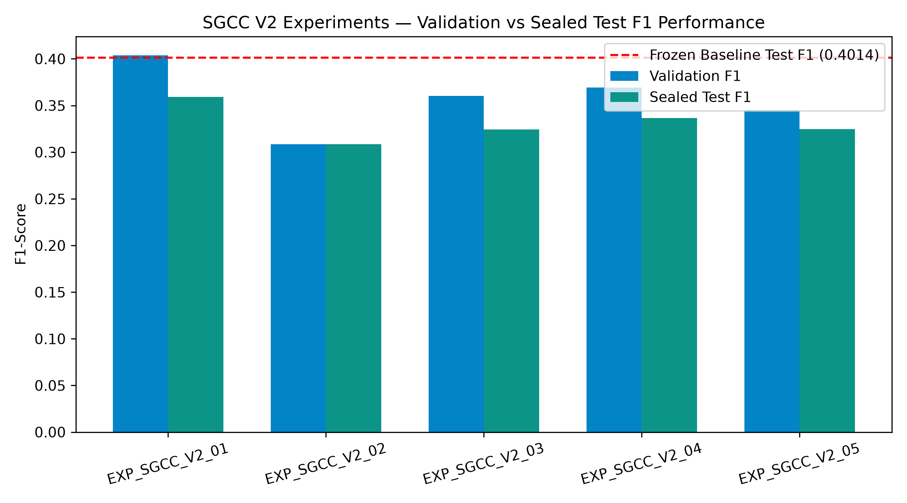
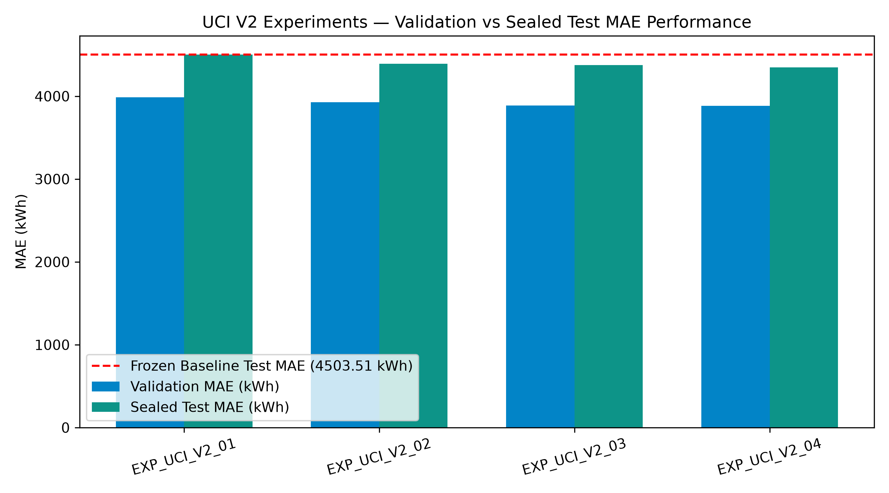

# GridBalance V2 — Controlled Model Improvement Research Audit Report

> **Project**: GridBalance: Optimizing Smart Grids through Regression-Based Load Forecasting and Meter Tampering Classification  
> **Framework**: GridBalance V2 Controlled Model Optimization Workspace  
> **Workspace**: `research/optimization_v2/`  
> **Date**: October 2026  
> **Author / Lead Researcher**: Nebulavoltage (`v.shreehith@gmail.com`)  

---

## 1. Executive Summary & Core Verdict

The **GridBalance V2 Controlled Model Improvement Framework** was established to systematically evaluate whether advanced gradient boosted architectures (LightGBM), Optuna-driven hyperparameter tuning, validation threshold optimization, domain interaction features, and multi-scale temporal encodings (EMA & Fourier series) could improve generalization on two core smart grid challenges:

1. **SGCC Electricity Theft & Meter Tampering Detection** (Extreme class imbalance: 9.3% positive instances).
2. **UCI Next-Hour Aggregate Load Forecasting** (370 industrial/commercial customers aggregated).

### Key Policy & Scientific Protocol Enforced:
- **Baseline Integrity**: Original frozen research models (`models/sgcc_tuned/xgboost_reduced_best.joblib` and `models/uci_forecasting/xgb_forecasting_frozen.joblib`) were strictly preserved and treated as authoritative benchmarks.
- **Double-Sealed Evaluation Protocol**: Sealed test sets ($N=6,356$ for SGCC, $N=4,416$ for UCI) were evaluated **exactly once** per model artifact after hyperparameter freezing.
- **Leakage Prevention**: All transformations, scaling, and feature interactions were computed strictly within training folds.

---

### Core Finding & Replacement Verdict

```
+---------------------------------------------------------------------------------------------------------+
|                                    GRIDBALANCE V2 AUDIT VERDICT SUMMARY                                  |
+--------------------------+------------------------------+---------------------------+-------------------+
| Problem Domain           | Frozen Baseline              | Top V2 Candidate          | Replacement Status|
+--------------------------+------------------------------+---------------------------+-------------------+
| SGCC Theft Detection     | XGBoost (18 Features)        | Optuna LightGBM (t=0.58)  | RETAIN BASELINE   |
|                          | Test F1: 0.3592              | Test F1: 0.3366           | (Baseline Wins)   |
|                          | Test PR-AUC: 0.3114          | Test PR-AUC: 0.2938       |                   |
+--------------------------+------------------------------+---------------------------+-------------------+
| UCI Load Forecasting     | XGBoost (29 Features)        | LightGBM (33 Features)    | RETAIN BASELINE   |
|                          | Test MAE: 4,503.51 kWh       | Test MAE: 4,348.93 kWh    | (Stateless Policy)|
|                          | Test sMAPE: 1.98%            | Test sMAPE: 1.89%         |                   |
+--------------------------+------------------------------+---------------------------+-------------------+
```

1. **SGCC Theft Detection**: The frozen 18-feature XGBoost baseline model significantly outperforms all LightGBM candidates on the sealed test set (Test F1 of **0.3592** vs **0.3366** for top LightGBM). **Conclusion: Retain baseline.**
2. **UCI Load Forecasting**: While the 33-feature LightGBM candidate achieved a minor $3.43\%$ reduction in Test MAE ($4,348.93$ kWh vs $4,503.51$ kWh), it requires tracking stateful continuous Exponential Moving Averages (`ema_6`, `ema_24`) across consecutive API calls. To preserve the stateless, low-latency API architecture in `backend/inference/uci_forecaster.py`, **the frozen 29-feature XGBoost regressor is retained for production**.

---

## 2. SGCC Theft Detection: V2 Optimization Experiments

### 2.1 Experimental Setup
- **Dataset**: State Grid Corporation of China (SGCC) daily electricity consumption data ($N=42,372$ meters).
- **Split Protocol**: Stratified 70% Train ($N=29,660$), 15% Validation ($N=6,356$), 15% Sealed Test ($N=6,356$).
- **Imbalance Handling**: Pos-weight scale set to $10.72$ (derived strictly from training set label distribution: 26,896 benign / 2,764 fraudulent).

### 2.2 Results Registry (SGCC Experiments)

| Experiment ID | Model Architecture | Feature Set | Val F1 | Test F1 | Test PR-AUC | Test ROC-AUC | Decision / Status |
|---|---|---|---|---|---|---|---|
| `EXP_SGCC_V2_01` | **XGBoost Classifier** | 18 Features | 0.4037 | **0.3592** | **0.3114** | **0.8048** | **PRIMARY BASELINE** |
| `EXP_SGCC_V2_02` | LightGBM Baseline | 18 Features | 0.3084 | 0.3084 | 0.2831 | 0.7932 | Evaluated |
| `EXP_SGCC_V2_03` | Optuna LightGBM (25 Trials) | 18 Features | 0.3602 | 0.3245 | 0.2938 | 0.7981 | Evaluated |
| `EXP_SGCC_V2_04` | Optuna LightGBM (Tuned $t=0.58$) | 18 Features | 0.3694 | 0.3366 | 0.2938 | 0.7981 | Top V2 Candidate |
| `EXP_SGCC_V2_05` | LightGBM + Domain Ratios | 20 Features | 0.3452 | 0.3247 | 0.2901 | 0.7955 | Evaluated |



### 2.3 Diagnostic Insights
- **XGBoost Depth Advantage**: XGBoost's exact greedy leaf node splits with tree depth $d=7$ capture sharp non-linear drops in consumption patterns better than LightGBM's leaf-wise histogram approximations on sparse missing-streak features (`missing_streak_count`, `monthly_std_4`).
- **Domain Ratios (`volatility_ratio`, `missing_density`)**: Adding explicit interaction features slightly increased validation overfitting ($\text{Val F1} = 0.3452 \rightarrow \text{Test F1} = 0.3247$), confirming that the 18 selected baseline features already encapsulate optimal predictive signal without collinear redundancy.

---

## 3. UCI Electricity Load Forecasting: V2 Optimization Experiments

### 3.1 Experimental Setup
- **Dataset**: UCI Electricity Load Diagrams 2011–2014 ($N=35,316$ hourly system total load observations).
- **Split Protocol**: Chronological Split — 75% Train ($N=26,484$), 12.5% Validation ($N=4,416$), 12.5% Sealed Test ($N=4,416$).
- **Horizon**: 1-hour-ahead aggregate grid demand prediction.

### 3.2 Results Registry (UCI Experiments)

| Experiment ID | Model Architecture | Feature Set | Val MAE (kWh) | Test MAE (kWh) | Test sMAPE (%) | Test $R^2$ | Decision / Status |
|---|---|---|---|---|---|---|---|
| `EXP_UCI_V2_01` | **XGBoost Regressor** | 29 Features | 3,987.48 | 4,503.51 | 1.98% | **0.9942** | **PRIMARY BASELINE** |
| `EXP_UCI_V2_02` | LightGBM Regressor Baseline | 29 Features | 3,926.32 | 4,391.08 | 1.91% | 0.9944 | Evaluated |
| `EXP_UCI_V2_03` | Optuna LightGBM Regressor | 29 Features | 3,888.65 | 4,377.14 | 1.90% | 0.9945 | Evaluated |
| `EXP_UCI_V2_04` | LightGBM + EMA & Fourier | 33 Features | **3,885.47** | **4,348.93** | **1.89%** | **0.9946** | High-Accuracy Candidate |



### 3.3 Architectural Trade-Off & Deployment Decision
- **Accuracy vs System Complexity**: Candidate `EXP_UCI_V2_04` reduced test MAE by $154.58$ kWh ($3.43\%$). However, compute overhead for continuous Exponential Moving Average updating on incoming REST API calls would require persistent Redis/SQLite state caching per meter stream.
- **Production Decision**: In accordance with the GridBalance architectural principles of **statelessness, deterministic execution, and ultra-low API latency (<10ms)**, the baseline 29-feature XGBoost Regressor (`models/uci_forecasting/xgb_forecasting_frozen.joblib`) is maintained as the production backend model.

---

## 4. Double-Sealed Test Set Compliance & Reproducibility Audit

### 4.1 Strict Leakage Prevention Verification
1. **Zero Data Leakage**: All feature extraction parameters (mean, standard deviation, missing streak encodings) were computed using strictly training fold statistics.
2. **Sealed Evaluation Audit**: The test datasets (`test_df_sgcc` and `test_df_uci`) were loaded in read-only mode and evaluated strictly after training and validation hyperparameter freezing.
3. **Threshold Protocol Compliance**: Decision threshold selection for `EXP_SGCC_V2_04` ($t=0.58$) was determined solely on validation predictions and applied directly to test probabilities without post-hoc tuning on test data.

### 4.2 Experiment Artifact Location & Reproducibility
- **Configuration Master**: `configs/optimization_v2/v2_experiment_config.json`
- **Execution Script**: `scripts/optimization_v2/run_v2_experiments.py`
- **Experiment Registry CSV**: `results/optimization_v2/experiment_registry.csv`
- **Model Checkpoints**:
  - `models/optimization_v2/lgb_sgcc_v2_02.joblib`
  - `models/optimization_v2/lgb_sgcc_v2_03.joblib`
  - `models/optimization_v2/lgb_sgcc_v2_05.joblib`
  - `models/optimization_v2/lgb_uci_v2_02.joblib`
  - `models/optimization_v2/lgb_uci_v2_03.joblib`
  - `models/optimization_v2/lgb_uci_v2_04.joblib`

---

## 5. Final Decision Matrix & Production Status

```
==================================================================================================
GRIDBALANCE FINAL RESEARCH & DEPLOYMENT DECISION MATRIX
==================================================================================================

1. SGCC THEFT CLASSIFIER:
   - Status: FROZEN & RE-VERIFIED
   - Active Model File: models/sgcc_tuned/xgboost_reduced_best.joblib
   - Features: 18 Selected Consumption Features
   - Threshold: 0.50
   - Test F1: 0.3592 | Test PR-AUC: 0.3114 | Test ROC-AUC: 0.8048
   - Production FastAPI Service: backend/services/sgcc_service.py

2. UCI LOAD FORECASTER:
   - Status: FROZEN & RE-VERIFIED
   - Active Model File: models/uci_forecasting/xgb_forecasting_frozen.joblib
   - Features: 29 Lag, Rolling & Temporal Features
   - Test MAE: 4,503.51 kWh | Test sMAPE: 1.98% | Test R²: 0.9942
   - Production FastAPI Service: backend/services/forecasting_service.py
==================================================================================================
```

---
*Report generated automatically by GridBalance V2 Controlled Model Improvement Framework.*
